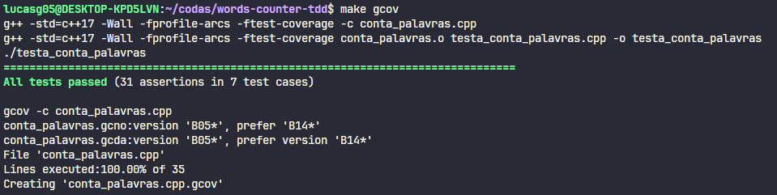

# Contador de Palavras usando TDD

## Autor
<p>Lucas Gabriel de Oliveira Lima - 231003406<p>
<table>
  <tr>
    <td align="center"><a href="https://github.com/lucasdbr05" target="_blank"><br /><sub><b>Lucas Lima</b></sub></a><br /></td>
</table>

## Configuração

```shell
sudo apt-get install g++
sudo apt-get install make
sudo apt-get install valgrind
sudo apt-get install cppcheck
sudo apt-get install clang-format-14
sudo apt-get install doxygen

sudo apt-get install python3-pip
sudo pip install cpplint
```

ou

```shell
make setup
```


## Run

Para compilar o arquivo principal, os testes e executá-los:
```shell
make all
```

Para analisar a cobertura dos testes:
```shell
make gcov
```

Para analisar problemas de memória estática e dinâmica:
```shell
make valgrind
make cppcheck
```

Para verificar os padrões de formatação do código:
```shell
make cpplint
```

## Sobre o projeto 
O projeto consiste em um programa que lê o conteúdo de um arquivo de texto (por padrão, definido como input.txt) e conta a frequência de cada palavra presente no texto. Após essa contagem, o programa retorna a frequência de cada palavra, com as palavras ordenadas em ordem lexicográfica ascendente.

Como as palavras podem conter diacríticos, foi assumida uma ordem diferente daquela dada pelos caracteres ASCII estendidos na codificação UTF-8. Especificamente, as letras acentuadas são ordenadas após suas correspondentes não acentuadas e antes da próxima letra não acentuada. Para letras com a mesma base não acentuada, a seguinte ordem é assumida: ~, ´, ^.

Com isso, a seguinte ordem lexicográfica é usada para a ordenação:

```shell
  aãáâbcçdeẽéêfghiĩíîjklmnñoõóôpqrstuũúûvwxyz
```
Nesse caso, letras maiúsculas são consideradas superiores às minúsculas e seguirão a mesma ordem descrita acima para letras maiúsculas.


## Resultados


Após compilar o projeto, executar os testes, e analizar a cobertura, obtive os seguintes resultados: 


