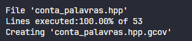

# Words Counter using TDD

## Author
<p>Lucas Gabriel de Oliveira Lima - 231003406<p>
<table>
  <tr>
    <td align="center"><a href="https://github.com/lucasdbr05" target="_blank"><br /><sub><b>Lucas Lima</b></sub></a><br /></td>
</table>

## Setup

```shell
sudo apt-get install g++
sudo apt-get install make
sudo apt-get install valgrind
sudo apt-get install cppcheck
sudo apt-get install clang-format-14
sudo apt-get install doxygen

sudo apt-get install python3-pip
sudo pip install cpplint
```

or

```shell
make setup
```


## Run

To compile the main file, the tests, and run the tests:
```shell
make all
```

To analyse test coverage:
```shell
make gcov
```

To analyze static and dynamic memory leaks:
```shell
make valgrind
make cppcheck
```

To check the code formatting standards:
```shell
make cpplint
```

## About the project

The project consists of a program that reads the content of a text file (by default, defined as input.txt) and counts the frequency of each word in the input. After this count, the program returns the frequency of each word, with the words sorted in ascending lexicographical order.

Since words may contain diacritics, an order different from the one given by extended ASCII characters in UTF-8 encoding was assumed. Specifically, accented letters are ordered after their corresponding unaccented letters and before the next unaccented letter. For letters with the same unaccented base, the order is assumed to be: '~', '´', '^'.

With this, the following lexicographical order is used for sorting:

```shell
  aãáâbcçdeẽéêfghiĩíîjklmnñoõóôpqrstuũúûvwxyz
```
In this case, uppercase letters are considered superior to lowercase letters and will follow the same order as above for uppercase letters.


## Results

After compiling the code, running the tests, and analyzing the coverage, I obtained the following results:


